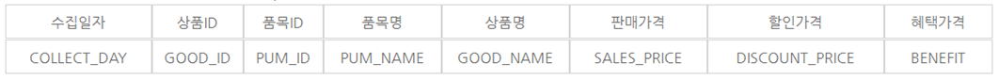

# Deep learning project - Time Series Data Prediction (Matlab, LSTM)

Writer : Harim Kang

# Organized Blog

'Read Me' posting in Korean is located at the address below.

[https://davinci-ai.tistory.com/11](https://davinci-ai.tistory.com/11)

# Project subject

The first topic was to analyze online product price data to predict current product prices.

However, due to the insufficient time and limited computing power compared to the vast amount of data, we modified the project to analyze the online price data of jeans and predict the jeans price in the near future.

The reason why I chose jeans out of many items is that I have more data than other items and I can wear them all season. (Cell phones and TV items were selected as jeans because of lack of historical data.)

For more items, I'll try to find a way later.

## Usage data

[https://www.data.go.kr/dataset/15004449/fileData.do](https://www.data.go.kr/dataset/15004449/fileData.do)

Online collection price information data consists of 8 items including price information collected online, collection date, item name and sales price.

The data collection period is available from January 2014 to October 2019.

The data I used in the analysis used data from January 2015 to October 2019.

## Data analysis process

1. Data Purification
2. Explore the data
3. Purify additional data for analysis
4. Model Selection for Prediction
5. Data prediction
6. Predictive Assessment (RMSE)
7. Semantic Analysis

## Data refining

Due to the lack of computing power (my laptop) compared to the huge amount of data (about 100 million data), I decided to use the average daily selling price per day. 

To explain the code, we retrieved the data by date and extracted only the collection date, item name, and selling price from the eight items. The code that finds and averages only the data whose item name is jeans and writes it to the new data.

It's been a while since I'm working with a lot more data than I thought. It took more than 30 minutes per year of data, and a good cpu computer seems to be faster.

Using the code above, we obtained a refined data set by calculating the average of the daily jeans sale price for each day.

## Explore data

This is a graph of the average price of jeans made for own use.

The data summary is shown below.

- Item: Jeans
- Period: January 01, 2015 ~ October 31, 2019 (total 1765 days)
- Minimum value: 32732 won
- Average value: 51998 won
- Maximum value: 166220 won

The graph above is a graph overlaid by year. It doesn't look very good.

## Purify additional data for analysis

Take the sales price average data for the newly created jeans and fill in the blanks for better learning results.

    % Jeans mean data refinement
    jean_data = readtable('mean\tt.xlsx');
    %	Fill the NaN value with the Nearest value.
    jean_data.sales_price = fillmissing(jean_data.sales_price, 'nearest');
    lenofdata = length(jean_data.sales_price);
    
    for i=1 : length(jean_data.collect_day)
        jean_data.collect_day(i) = strip(jean_data.collect_day(i),"'");
    end
    
    Y = jean_data.sales_price;
    data = Y';

matlab handles white space in data with a function called fillmissing. At this time, we put the nearest value 'nearest' as a parameter because we thought the data had a trend. The code below uses the strip function to delete special characters in string characters.

    %   2015.01.01 ~ 2019.05.06 (90%) : Training Data Set
    %   2019.05.07 ~ 2019.10.31 (10%) : Test Data Set
    numTimeStepsTrain = floor(0.9*numel(data));
    dataTrain = data(1:numTimeStepsTrain+1);
    dataTest = data(numTimeStepsTrain+1:end);

In order to train the model well and evaluate it, we distinguished between training and test datasets. Since the amount of data is not very large, I divided the ratio by 9: 1 to get better results.

    %   Normalize sales_price to a value between 0 and 1 (Training Data Set)
    mu = mean(dataTrain);
    sig = std(dataTrain);
    dataTrainStandardized = (dataTrain - mu) / sig;
    XTrain = dataTrainStandardized(1:end-1);
    YTrain = dataTrainStandardized(2:end);

Also, the selling price is a very large number. (10,000 units) So I did a normalization to learn more. We are going to train after changing the number to a relative value between 0 and 1.

## Model Selection for Prediction

I chose a LSTM (Long Short-Term Memory models) model and applied it to the data. My data is organized by date in daily order. This is called 'Time Series' data, which is one of the Sequence data types. Sequence type data uses a deep learning model called Recurrent Neural Networks (RNN).

RNN

However, the data that you want to use has to play an important role. In the case of the existing RNNs, the farther you are from the earlier data, the more oblivious the forgetting becomes.

The LSTM adds input gates and output gates to memory cells in the hidden layer to clear out unnecessary memory and determine what to remember. That's why LSTM is more suitable for Time Series than RNN.

Detailed algorithm descriptions will be further summarized as you study Deep Learning.

In Matlab, set the LSTM option with the following code: This is the code that increased MaxEpochs to 500 in the existing Matlab LSTM tutorial.

    %LSTM Net Architecture Def
    numFeatures = 1;
    numResponses = 1;
    numHiddenUnits = 200;
    layers = [ ...
        sequenceInputLayer(numFeatures)
        lstmLayer(numHiddenUnits)
        fullyConnectedLayer(numResponses)
        regressionLayer];
    options = trainingOptions('adam', ...
        'MaxEpochs',500, ...
        'GradientThreshold',1, ...
        'InitialLearnRate',0.005, ...
        'LearnRateSchedule','piecewise', ...
        'LearnRateDropPeriod',125, ...
        'LearnRateDropFactor',0.2, ...
        'Verbose',0, ...
        'Plots','training-progress');

You can train the network using the above options as shown below. The Matlab code is like the code below.

    %	Train LSTM Net
    net = trainNetwork(XTrain,YTrain,layers,options);

Running the above code will train the model as shown below. Iteratively evaluates itself within the training dataset.

LSTM Net Architecture Model Training Progress (Epoch: 250)

## Data prediction

Training data was normalized before training. Normalize test data. Then start predicting against the test data set.

    %	Normalize sales_price to a value between 0 and 1 (Testing Data Set)
    dataTestStandardized = (dataTest - mu) / sig;
    XTest = dataTestStandardized(1:end-1);
    net = predictAndUpdateState(net,XTrain);
    [net,YPred] = predictAndUpdateState(net,YTrain(end));
    
    %   Predict as long as the test period (2019.05.07 ~ 2019.10.31)
    numTimeStepsTest = numel(XTest);
    for i = 2:numTimeStepsTest
        [net,YPred(:,i)] = predictAndUpdateState(net,YPred(:,i-1),'ExecutionEnvironment','cpu');
    end

The code that executes the for statement as much as the test data, puts the predicted value in YPred, and updates and initializes the net.

## Predictive evaluation (RMSE)

YPred contains the predicted value and YTest contains the actual correct answer. To assess the performance of the model, we use the MSE or RMSE to check the error of the data. I will use RMSE here. (I'll add a description later.)

    %   RMSE calculation of test data set
    YTest = dataTest(2:end);
    YTest = (YTest - mu) / sig;
    rmse = sqrt(mean((YPred-YTest).^2))

The result is shown below.

RMS with Epoch 250: 9192.5498 (0.4 standardized between 0 and 1)

RMS with Epoch 500: 7956.2427 (0.3 standardized between 0 and 1)

## Result and semantic analysis

Let's solve the normalization and show it as a graph.

    %	Denormalize Data
    YPred = sig*YPred + mu;
    YTest = sig*YTest + mu;
    
    %   X Label : Collect Day
    x_data = datetime(jean_data.collect_day);
    x_train = x_data(1:numTimeStepsTrain+1);
    x_train = x_train';
    x_pred = x_data(numTimeStepsTrain:numTimeStepsTrain+numTimeStepsTest);
    
    %   Train + Predict Plot
    figure
    plot(x_train(1:end-1),dataTrain(1:end-1))
    hold on
    plot(x_pred,[data(numTimeStepsTrain) YPred],'.-')
    hold off
    xlabel("Collect Day")
    ylabel("Sales Price")
    title("Forecast")
    legend(["Observed" "Forecast"])
    
    %   Train + Test + Predict Plot
    figure
    plot(x_data,Y)
    hold on
    plot(x_pred,[data(numTimeStepsTrain) YPred],'.-')
    hold off
    xlabel("Collect Day")
    ylabel("Sales Price")
    title("Compare Data")
    legend(["Raw" "Forecast"])

Below is a graph of Train + Predict + Test when learning Epoch 250.

Below is the Train + Predict graph for the Epoch 500.

Let's interpret the meaning. From the point in time at which the prediction began, the predictions at close range show relatively little error. This is a characteristic of the LSTM, and it can be seen that the influence of the near seal is large. The larger the error, the more the error accumulates. (If it's the wrong interpretation, please comment. I'll fix it.)

We only predicted the price of one item, the jeans, but if time and computing power allowed it, we thought that we would be able to expand the product to all the data of all items, and predict the commodity price as well as the stock forecast. I think this will help you to know the price of the item you want to buy in advance or to set an appropriate price.

## Reference

RNN and LSTM images : [https://ratsgo.github.io/natural language processing/2017/03/09/rnnlstm/](https://ratsgo.github.io/natural%20language%20processing/2017/03/09/rnnlstm/)
